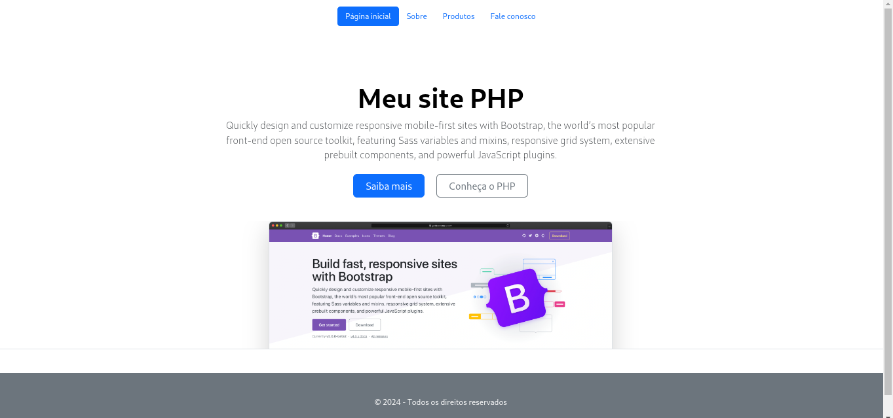

# First PHP Website

 
 

  
   

# Índice

- [Descrição do Projeto](#descrição-do-projeto)
- [Tecnologias utilizadas](#tecnologias-utilizadas)
- [Autor](#author)

# Descrição do Projeto

Um site simples usando a linguaguem PHP e o framework web Bootstrap, visando estudar a forma como o PHP é usado na criação e estruturação de uma página web.

# Tecnologias utilizadas

- PHP
- HTML
- Bootstrap
- Git e Github

# Autor

 Paloma Santos Ferreira 
